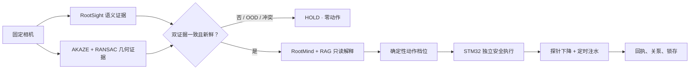

# RootScope — AdventureX 2026 地瓜机器人赛道银奖 · 最终第 2 名

<p align="center">
  <strong>RDK X5 × STM32F103C8T6 固定式根区灌溉舱</strong><br>
  <em>AdventureX 2026 · D-Robotics “Give AI a Body” · Silver Award · 2nd Place</em>
</p>

<p align="center">
  <a href="https://github.com/Xiaomiju-x/RootScope-AdventureX2026/actions/workflows/ci.yml"></a>
  <a href="LICENSE"></a>
  <a href="docs/RESULTS_AND_BOUNDARIES.md"></a>
  <a href="docs/REPRODUCIBILITY.md"></a>
  <a href="SECURITY.md"></a>
</p>

<p align="center">
  <a href="#中文">中文</a> · <a href="#english">English</a> ·
  <a href="docs/QUICKSTART.md">Quickstart</a> ·
  <a href="docs/ARCHITECTURE.md">Architecture</a> ·
  <a href="docs/DEMO.md">Demo</a> ·
  <a href="docs/REPRODUCIBILITY.md">Reproduce</a>
</p>


## 中文

RootScope 是一台面向受控实验与科普演示的**固定式根区灌溉机器人原型**。RDK X5 负责相机感知、双证据判定、本地 LLM/RAG 只读解释和可审计决策；STM32F103C8T6 负责有界动作、心跳看门狗、急停锁存和最终关泵。项目在 AdventureX 2026 D-Robotics「Give AI a Body」赛道获得**银奖、最终第 2 名**。

> 重要澄清：照片中可见的 Scout Mini 轮式底盘只被复用为承载架和供电底座。决赛作品不依靠移动、导航或底盘驱动，最终演示链中没有 SLAM、Nav2 或轮式运动。

本仓库公开最终可复现源码、STM32 V15 固件工程、RDK X5 运行代码、训练与转换流水线、数据治理合同、模型说明、受控真机证据以及经过隐私处理的演示媒体。账号、密钥、私有设备身份、构建缓存、未获再分发授权的数据和第三方基础模型不会进入仓库。

### 一句话工作流



LLM 不直接控制泵、电机、串口或 GPIO。模型输出不能覆盖确定性安全门；未知输入、低质量图像、证据冲突、证据过期、串口异常和心跳丢失均进入 `HOLD` 或安全停止。

### 决赛实现

| 层 | 最终实现 | 权限边界 |
|---|---|---|
| 视觉 | 固定答辩卡的 CPU ONNX 语义分类 + AKAZE/RANSAC 几何复核；BPU 作为板端视觉执行/资格证据 | 只生成证据，不直接动作 |
| 解释 | RootMind Fast / Deep / BM25-HOLD 按需换入；本地 LLM 运行在 CPU | 只读解释，不改变档位 |
| 决策 | 双证据一致、质量/OOD/新鲜度门控、确定性映射 | 任一条件不满足即 fail-closed |
| 执行 | STM32F103C8T6、28BYJ-48 + ULN2003、PB6 单泵继电器 | MCU 保留最终关泵与锁存权 |
| 机械 | 固定龙门、齿条探针、单向下降 | 无自动回升；每轮人工回顶 |

最终四状态映射是**演示用步数合同**，不是厘米、土壤含水量或生物学根深推断：

| 现场状态 | STM32 档位 | 相对步数 | 行为 |
|---|---:|---:|---|
| 纯沙 / 非目标 | 0 | 0 | `HOLD`，不运动 |
| 草丛 | 1 | 1024 | 最浅下降档 |
| 灌木 | 2 | 1536 | 中间下降档 |
| 幼树 | 3 | 2048 | 最深下降档 |

下降是单向的；机构没有自动回升和顶部传感器。下一轮前必须由操作员断能确认并手动回顶。竞赛链在探针到位后执行固定 **5 秒**定时注水。

### 已验证结果与真实性边界

| 证据 | 已验证结论 | 不代表 |
|---|---|---|
| 四张固定打印卡 | 受控现场条件下 4/4 双证据识别 | 开放世界植物识别精度 |
| 完整物理链 | 草丛卡两次完成“识别 → 1024 步下降 → 5 秒注水 → 关泵锁存” | 长期田间可靠性或农艺处方 |
| V15 档位 | 1024、1536、2048 三档分别完成受控验证 | 步数等于毫米/厘米/真实根深 |
| BPU 回放 | canonical 与 native persistent 两条路径均为 43/43；记录的均值余弦相似度为 1.0 | 泛化精度、实时相机端到端精度或动作成功率 |
| 故障路径 | 未知、冲突、过期、断联进入 HOLD/STOP，输出保持关闭 | 工业安全认证 |

原始、可核验的公开回执位于 [`evidence/public/`](evidence/public/)，指标解释见 [`docs/RESULTS_AND_BOUNDARIES.md`](docs/RESULTS_AND_BOUNDARIES.md)。仓库不会把测试夹具、回放结果或人工观察写成持续在线性能。

### 演示

<p align="center">
  <a href="assets/media/demo/rootscope-probe-and-irrigation-demo.mp4">
    
  </a><br>
  <sub>点击图片观看探针下降与注水演示；完整分镜、边界和素材清单位于 <a href="docs/DEMO.md">docs/DEMO.md</a>。</sub>
</p>


### 5 分钟软件快速开始（不连接设备）

要求 Python 3.10+。下面的参考层只读取合成 JSON，不会打开相机、串口、GPIO、网络控制端点或执行器。

```bash
git clone https://github.com/Xiaomiju-x/RootScope-AdventureX2026.git
cd RootScope-AdventureX2026
python -m venv .venv
# Linux/macOS: source .venv/bin/activate
# Windows PowerShell: .venv\Scripts\Activate.ps1
python -m pip install --upgrade pip
python -m pip install -e ".[dev]"

rootscope-public examples/grass_agree.json
rootscope-public examples/conflict_hold.json
python tools/audit_public_release.py
pytest
```

预期：一致的合成证据产生 `proposal_only: true` 的抽象档位；冲突/OOD 示例产生 `HOLD`；`hardware_command` 始终为 `null`。完整说明见 [`docs/QUICKSTART.md`](docs/QUICKSTART.md)。

### 仓库地图

```text
src/rootscope_public/       设备无关、proposal-only 的最小安全参考层
software/rdk-x5/            决赛 RDK X5 应用、视觉、RAG/LLM、工具与测试
firmware/stm32f103-v15/     STM32F103 V15 CubeMX/HAL 工程与安全状态机
hardware/design/            机械、电气、BOM、SVG 图纸与设计记录
research/rootscope_v3/      RootSight、RootMind、RAG2、评测与模型合同
pipelines/                  数据治理、训练、转换、BPU、发布与验收流水线
model-assets/               可再分发的最终模型资产、哈希与获取说明
assets/print-cards/         决赛固定答辩卡与打印清单
assets/media/               隐私清理后的照片、视频、分镜与媒体清单
evidence/public/            清理后的机器可读回执与真机证据
docs/                       架构、搭建、复现、安全与故障排查
```

推荐阅读顺序：[`快速开始`](docs/QUICKSTART.md) → [`系统架构`](docs/ARCHITECTURE.md) → [`硬件与接线`](docs/HARDWARE_WIRING.md) → [`RDK X5 部署`](docs/RDK_X5_DEPLOYMENT.md) → [`STM32 构建`](docs/STM32_BUILD.md) → [`复现协议`](docs/REPRODUCIBILITY.md)。

### 模型、数据与媒体权利边界

- 仓库只分发项目有权分发的自研代码、适配器/转换产物与声明清楚的资产；所有大文件必须带 SHA-256 和模型卡。
- Qwen、BGE 等第三方基础模型不打包进仓库。复现者须从上游获取并遵守各自许可证；详见 [`docs/MODEL_ASSETS.md`](docs/MODEL_ASSETS.md)。
- 数据流水线、合同、来源登记和审计脚本公开；`rights_approved=false` 或无法证明再分发权的图片不作为数据集发布。详见 [`docs/DATA_GOVERNANCE.md`](docs/DATA_GOVERNANCE.md)。
- 现场照片和视频已移除 EXIF/GPS、位置水印和敏感屏幕内容。版权、肖像权与商标说明以媒体清单为准。
- 账号密码、API key、token、私钥、真实私网地址、设备唯一标识、用户目录、VPS 配置、缓存和构建中间物永不发布。

这是一份**可复现源码发布**，不是原开发硬盘的无差别镜像。排除缓存、上游依赖和无权再分发材料，是为了让每一项公开资产都有清楚来源、许可和用途。

### 安全

不要照抄竞赛接线后无人值守运行。真实水泵、电机和继电器系统必须具备独立急停、功率侧隔离/互锁、限位、漏水保护、看门狗、保险与人工监护。首次上电、烧录、运动和通水必须逐级验收，且先断开执行器电源。请先阅读 [`SECURITY.md`](SECURITY.md) 与 [`docs/HARDWARE_WIRING.md`](docs/HARDWARE_WIRING.md)。

### 参与与引用

欢迎修复可复现性、文档、测试和安全边界问题。提交前请阅读 [`CONTRIBUTING.md`](CONTRIBUTING.md)、[`CODE_OF_CONDUCT.md`](CODE_OF_CONDUCT.md) 和 [`GOVERNANCE.md`](GOVERNANCE.md)。安全问题请按 [`SECURITY.md`](SECURITY.md) 私下报告。

论文、课程、展览或二次开发引用请使用 [`CITATION.cff`](CITATION.cff)。项目采用分路径许可：自研代码主要为 [Apache License 2.0](LICENSE)，硬件设计为 CERN-OHL-S-2.0，文档/团队媒体为 CC BY 4.0，第三方文件保留原许可；以 [`LICENSE_MATRIX.md`](LICENSE_MATRIX.md)、[`NOTICE`](NOTICE) 与邻近清单为准。相关商标归各自权利人所有。

---

## English

RootScope is a **stationary root-zone irrigation robot prototype** built for AdventureX 2026. It won the **Silver Award and finished 2nd** in the D-Robotics “Give AI a Body” track.

The RDK X5 produces camera evidence, checks semantic/geometric agreement, runs a local read-only LLM/RAG explanation layer, and proposes a bounded tier. An STM32F103C8T6 independently enforces timed motion, heartbeat/watchdog behavior, latching stop, and pump-off authority.

> The Scout Mini wheeled base visible in some photos was reused only as a carrier and power stand. RootScope did not use locomotion, navigation, SLAM, Nav2, or wheel control in the final competition chain.

### What was actually demonstrated

- Four fixed printed answer cards under controlled event conditions, checked by semantic and geometric evidence.
- A deterministic mapping: bare sand `0`, grass `1024`, shrub `1536`, young tree `2048` relative steps.
- Two complete grass-card runs: recognition → probe descent → 5-second watering → pump-off and latched safe state.
- Manual return-to-top between runs; there is no automatic retraction or top limit sensor.
- CPU-hosted RootMind Fast/Deep/BM25-HOLD roles loaded on demand, not concurrently resident “multiple agents.”
- Two BPU replay paths at 43/43 recorded cases with mean cosine similarity 1.0. This is deployment evidence, not open-world accuracy.

The four classes are an event contract for fixed cards—not species identification, agronomic water-demand estimation, biological root-depth inference, or long-term field validation.

### Reproduce the device-free safety layer

```bash
git clone https://github.com/Xiaomiju-x/RootScope-AdventureX2026.git
cd RootScope-AdventureX2026
python -m venv .venv
source .venv/bin/activate              # Windows: .venv\Scripts\Activate.ps1
python -m pip install -e ".[dev]"
rootscope-public examples/grass_agree.json
rootscope-public examples/ood_hold.json
python tools/audit_public_release.py
pytest
```

This path is deliberately device-free: it cannot open a serial port, camera, GPIO, relay, pump, or remote-control endpoint. For full artifact-level reproduction, follow [`docs/REPRODUCIBILITY.md`](docs/REPRODUCIBILITY.md); for physical hardware, read the safety gates first.

### Documentation

| Guide | Purpose |
|---|---|
| [Quickstart](docs/QUICKSTART.md) | Install, run fixtures, tests, and release audit |
| [Architecture](docs/ARCHITECTURE.md) | Authority separation and runtime data flow |
| [Hardware & wiring](docs/HARDWARE_WIRING.md) | Final pin map, power domains, staged bring-up |
| [Mechanical design](docs/MECHANICAL.md) | Stationary gantry, probe, water path, carrier clarification |
| [RDK X5 deployment](docs/RDK_X5_DEPLOYMENT.md) | Generic, credential-free board deployment |
| [STM32 build](docs/STM32_BUILD.md) | Regenerate/build/flash V15 safely |
| [Models](docs/MODEL_ASSETS.md) | Model manifests, upstream dependencies, hashes |
| [Data governance](docs/DATA_GOVERNANCE.md) | Source groups, licenses, holdouts, redistribution |
| [Reproducibility](docs/REPRODUCIBILITY.md) | Evidence levels and exact verification sequence |
| [Demo](docs/DEMO.md) | Media chapters and truthful narration |
| [FAQ & troubleshooting](docs/TROUBLESHOOTING.md) | Common software, camera, serial, and mechanism issues |

### License and safety

Project-authored software is primarily Apache-2.0, original hardware design is CERN-OHL-S-2.0, and project documentation/team media is CC BY 4.0. Third-party HAL/CMSIS, models, datasets, and print cards retain their applicable terms; see [`LICENSE_MATRIX.md`](LICENSE_MATRIX.md). Do not use this prototype as an unattended irrigation controller or safety-certified product. See [`SECURITY.md`](SECURITY.md).

If this release helps your research, course, or robot project, please cite the repository using [`CITATION.cff`](CITATION.cff).
