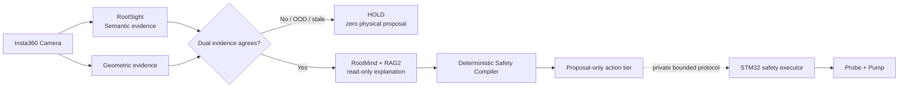

# RootScope｜固定式根区灌溉舱

[](https://xiaomiju.xyz/)
[](https://xiaomiju.xyz/)
[](https://xiaomiju.xyz/)
[](LICENSE)
[](SECURITY.md)

> 让 AI 的每一次浇水，都可解释、可拒绝、可追溯。  
> Make every AI-triggered irrigation action explainable, rejectable and auditable.

RootScope 是一个面向荒漠育苗、温室和节水灌溉实验的固定式根区机器人原型。  
系统使用 RDK X5 完成视觉感知、证据融合、本地 LLM/RAG 解释和受限动作提案，
由 STM32 独立承担执行器时序、心跳、超时、急停和最终断泵。

🌐 **项目官网：<https://xiaomiju.xyz/>**


## 这不是“分类模型直接开水泵”



核心原则：

- **模型只提供证据，不拥有执行权。**
- 语义与几何证据冲突、未知目标、质量不足或状态异常时统一 `HOLD`。
- LLM 和 RAG 仅生成解释，不能改变动作档位，也不能访问串口、GPIO 或水泵。
- 上位机只生成有限、可审计的 `proposal`；下位机保留最终断泵权。
- 线上网站是只读证据门户，不反向连接现场设备。

## AdventureX 2026 现场状态

当前公开结果均为 2026-07-25 的受控现场实测，不代表开放野外泛化：

| 能力 | 已验证结果 | 边界 |
|---|---|---|
| 四类答辩目标 | 草丛、灌木、幼树、纯沙卡实时识别 4/4 | 固定实体卡与受控现场 |
| 探针档位 | 三档单向下降映射完成 | 步数不是厘米或生物学根深 |
| 完整物理链 | 草丛：识别 → 下降 → 5 秒注水 → 关泵锁存，现场成功两次 | 每轮需人工回顶 |
| 本地模型 | Fast / Deep / BM25 按需换入 | LLM 在 CPU，且只读 |
| BPU | canonical 与 native persistent 两条 43/43 回放 | 当前为资格与辅助证据，不是动作权威 |
| 故障策略 | 未知、冲突、超时、通信异常均 fail-closed | 不自动重试物理动作 |

## 算法栈

### RootSight｜双证据视觉

现场链使用 CPU ONNX 语义分类与 AKAZE/RANSAC 几何复核。项目还设计了图像质量门、
Energy OOD、split-conformal 不确定性与多帧共识，但公开仓库不包含权重、模板、
阈值和现场标定数据。

### RootMind｜本地逻辑微集群

- Fast：0.5B 量级快速结构化解释；
- Deep：1.7B 量级领域解释；
- Deterministic：BM25 检索与 `HOLD` 模板降级；
- `ONE_MODEL_AT_A_TIME`，适应有限内存边缘设备；
- 所有输出均经过严格结构化和权限隔离。

### RAG2｜证据知识库

公开指标：17 个来源、42 个知识块、BM25 Recall@5 92.19%、Forbidden
Recall@5 94.44%、Citation Escape 0。原始语料、gold/forbidden 集和索引不在
本仓库中发布。

### RootScope-Ω｜证据到动作

`Evidence DAG`、`Hybrid Belief State`、`Counterfactual Failure Core`、
`Risk-Bounded Value of Evidence (RB-VoE)`、`Plant2Action`、
`Deterministic Safety Compiler`、`Truth Ribbon` 和 `Claim Ledger`
共同约束“哪些事实足够支持一次有限动作”。

本仓库只提供兼容这些思想的**最小安全参考实现**，不发布生产策略核、
评分函数、阈值、故障注入矩阵或真实设备适配器。

## 仓库里有什么

```text
src/rootscope_public/     # 可运行的 proposal-only 安全参考实现
examples/                 # 完全合成、无设备连接的输入样例
tests/                    # HOLD、证据冲突、LLM 零权限等测试
docs/                     # 架构、模型卡、硬件和复现边界
.github/workflows/        # 仅运行软件单元测试
```

快速体验：

```bash
python -m pip install -e ".[dev]"
rootscope-public examples/grass_agree.json
rootscope-public examples/conflict_hold.json
python tools/audit_public_release.py
pytest
```

输出是可审计的抽象提案，例如：

```json
{
  "decision": "PROPOSE",
  "action_tier": 1,
  "proposal_only": true,
  "hardware_command": null
}
```

参考实现**永远不会**打开串口、相机、GPIO、网络控制端点或执行器。
仓库内置发布审计会拒绝常见密钥格式、私钥、大模型/固件产物、私网地址和
设备写入代码。

## Open-core 边界

本仓库不是整机复刻包。为保护参赛原创、现场安全和第三方数据许可，以下内容不发布：

- Qwen / DeepSeek API Key 或任何账号、密码、Token、私钥；
- 视觉、BPU、LLM、LoRA、Embedding 权重和转换产物；
- 训练集、打印卡原图、现场抓拍、RAG 原始语料和提示词；
- 真实视觉阈值、标定矩阵、模板特征和数据划分；
- STM32 固件、串口帧、解锁/心跳/时序、引脚映射和泵控实现；
- RootScope-Ω 生产策略核、完整 RB-VoE、Safety Compiler 和故障矩阵；
- X5 一键部署、systemd、udev、网络、VPS、防火墙和现场设备配置；
- 私有证据、IP 地址、设备标识与不可变发布包。

详见 [公开与保留边界](docs/OPEN_CORE_BOUNDARY.md)。

## 安全声明

不要把本仓库的参考代码用于真实水泵、电机、阀门或其他执行器。真实系统需要独立
硬件急停、断连关断、看门狗、功率侧互锁、机械限位、人工监护和场景风险评估。
详见 [SECURITY.md](SECURITY.md)。

## 团队分工

| 角色 | 工作 |
|---|---|
| 队长 / 算法 | RDK X5 代码、视觉、CPU/BPU、本地 LLM、RAG2、RootScope-Ω、上位机与联调 |
| 硬件 | STM32、USB-TTL、继电器、水泵、电机驱动、电源和电气安全 |
| 机械结构 | 固定灌溉舱、相机架、探针、水路、接水区与干湿分离 |
| 运维 / 宣讲 | 官网、海报、PPT、演示流程、证据整理和答辩 |

## License

- 本仓库中实际发布的源代码：Apache License 2.0；
- RootScope 名称、标识和未发布资产不因本仓库获得授权；
- 第三方名称和商标归各自权利人所有。

如果你在论文、报道或技术展示中引用本项目，请使用 [CITATION.cff](CITATION.cff)。
