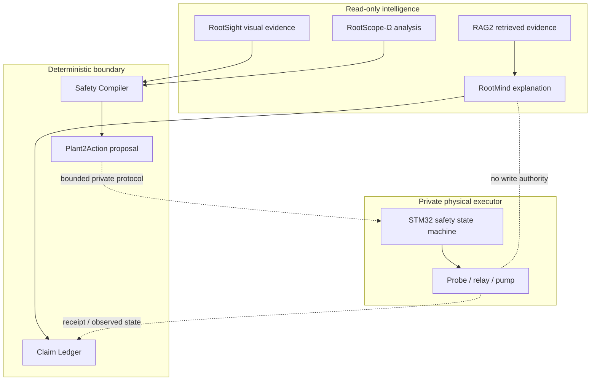

# Architecture

## Authority separation

RootScope is organized around evidence and authority rather than around one
large model.

The dotted boundary between `ActionProposal` and the STM32 is intentionally not
implemented in this repository.

## Public data contract

`EvidenceBundle` represents only the minimum public signals needed to explain
the safety pattern:

- semantic label;
- independent geometric label;
- image quality state;
- OOD state;
- evidence freshness;
- lower-controller safety state.

`ActionProposal` contains an abstract tier and reason codes. It explicitly keeps
`hardware_command = null`.

## Fail-closed ordering

1. Reject an unknown class.
2. Reject inadequate image quality.
3. Reject OOD input.
4. Reject stale evidence.
5. Reject unsafe device state.
6. Reject missing geometry verification.
7. Reject semantic/geometric disagreement.
8. Hold non-target scenes.
9. Only then emit an abstract tier.

The public confidence field is recorded but no production confidence threshold
is released. High confidence never overrides an independent safety failure.

