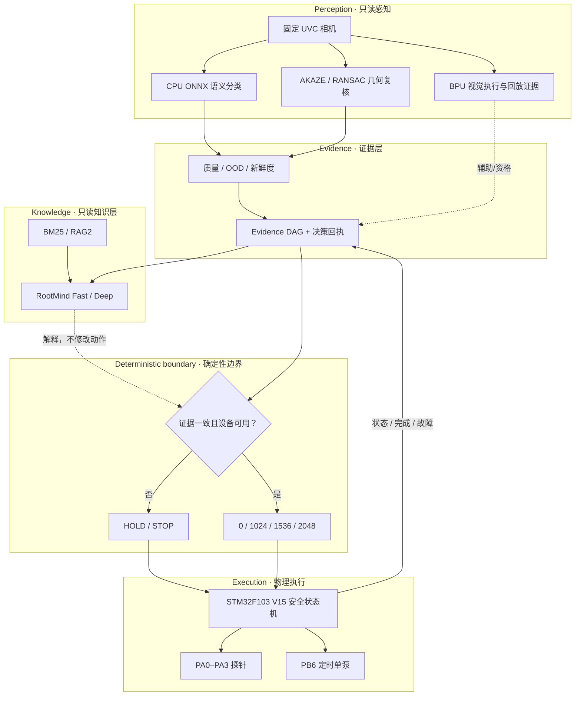
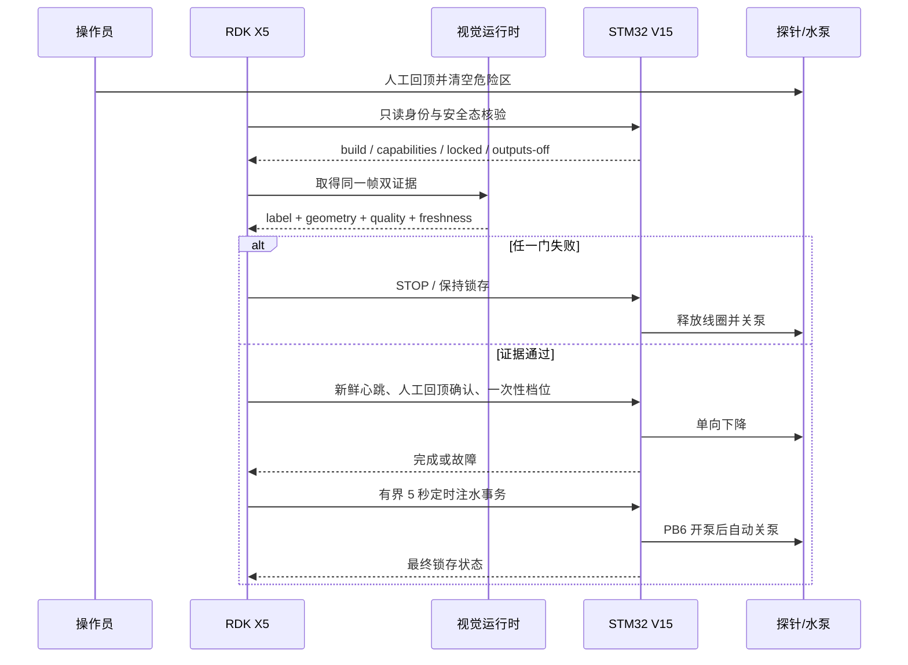

# 系统架构 / Architecture

RootScope 的核心不是“一个模型控制水泵”，而是**证据生产、确定性决策和物理执行三种权限相互隔离**。任何高置信度都不能越过缺失的独立证据或不安全的下位机状态。

## 1. 运行时总览

## 2. 权限矩阵

| 组件 | 可读 | 可写 | 明确禁止 |
|---|---|---|---|
| RootSight 视觉 | 相机帧、模型、模板 | 证据对象 | 串口、GPIO、动作档位 |
| BPU 路径 | 固定输入、编译模型 | 推理结果/回执 | 直接控制执行器 |
| RAG2 / RootMind | 证据、检索块 | 解释与引用 | 改写动作、访问硬件 |
| 确定性门控 | 结构化证据、设备状态 | `HOLD` 或有限档位 | 自由文本命令、越权重试 |
| RDK X5 协调器 | 已批准档位、STM32 状态 | 有界协议事务 | 绕过固件身份和锁存 |
| STM32 V15 | 心跳、档位、定时任务 | 电机/继电器输出、状态回执 | 自由运动、无界开泵、自动回升 |

根目录 `src/rootscope_public/` 是这套权限模式的最小、设备无关参考实现。完整竞赛代码位于 `software/rdk-x5/` 和 `firmware/stm32f103-v15/`。

## 3. 证据判定顺序

判定采用固定优先级；越靠前的失败越先返回：

1. 类别不在冻结合同内；
2. 图像质量不足；
3. OOD/未知输入；
4. 证据过期或不是同一帧；
5. STM32 未处于可接受安全状态；
6. 几何复核缺失；
7. 语义与几何证据冲突；
8. 非目标/纯沙；
9. 仅在以上全部通过后生成有限档位。

置信度只能补充证据，不能覆盖任何前置失败。

## 4. 一轮物理事务

一次人工回顶确认只允许一次下降；失败不自动重试物理动作。

## 5. 模型运行方式

- 视觉主链在受控答辩卡合同下运行；BPU 与 CPU 路径的回放一致性是部署证据，不是田间泛化结论。
- RootMind 的 Fast、Deep、BM25/HOLD 是按需加载的逻辑角色；有限内存板上不是多个大模型并发常驻。
- LLM 运行在 CPU，BPU 用于视觉模型。所有 LLM 输出先进入结构校验和权限隔离。
- RAG 文本提供出处与解释，不构成农艺处方，也不进入 STM32 协议字段。

## 6. 故障与恢复

STM32 在复位、UART 故障、心跳超时、硬超时或 STOP 时关闭 PB6、释放 PA0–PA3 并锁存。恢复需要重新核验身份、确认输出关闭、排除机械/漏水故障和显式人工操作。RDK 端不能把进程重启当成物理恢复。

## 7. 非目标能力

最终作品不包含移动底盘控制、自动回升、顶部限位、土壤水分闭环、开放世界物种识别、真实根深预测、远程无人值守灌溉或工业安全认证。旧设计文档中出现的 F407、多泵、称重、移动底盘等方案是历史研究分支，不代表最终 V15 实物配置。

## English summary

RootScope separates evidence, deterministic policy, and actuator authority. Vision and LLM/RAG are read-only. Only a bounded deterministic map can request one of three downward presets, and the STM32 retains watchdog, timeout, latching-stop, and pump-off authority. Any missing, stale, conflicting, OOD, or unsafe evidence fails closed. The final prototype is stationary and has no automatic retraction.
