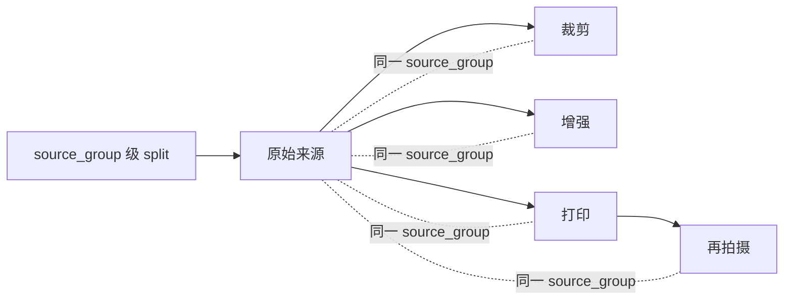

# 数据治理 / Data Governance

RootScope 公开数据工作的目标不是“图片越多越好”，而是每个样本都能回答：来自哪里、是否允许使用/再分发、与哪些派生样本同源、进入了哪个 split、是否参与训练、是否属于永久留出。

## 1. 分类合同

视觉合同冻结为可见形态：`grass_clump`、`low_shrub`、`young_tree` 和 `unknown/non_target`。它明确禁止把结果表述为：

- 物种鉴定；
- 根深推断；
- 农艺需水量推断；
- 田间灌溉处方。

完整合同见 [`software/rdk-x5/configs/class_contract.json`](../software/rdk-x5/configs/class_contract.json)。

## 2. 来源组优先

同一个原始资产的裁剪、增强、打印和再拍摄必须继承同一个 `source_group`，并落在同一个 split。不能按帧随机切分连续视频或打印重拍图，否则近重复会泄漏到训练与测试。



## 3. 记录字段

可用样本至少应有：

- 稳定 `asset_id`、`source_group`、SHA-256；
- 来源提供者、来源页面、下载定位符、作者、许可证和许可证 URL；
- 可见形态标签、域、资产角色、split；
- 审核状态、审核者/流程版本、排除原因；
- 本地采集时的 capture/session/optical-domain ID；
- 是否 PTQ calibration、是否 sealed/permanent holdout；
- 再分发权限的独立布尔值或许可判定。

不要把机器教师/VLM 的标签当作人工 ground truth。它只能作为候选或二次审计信号，最终状态必须遵循登记政策。

## 4. 许可与再分发

数据的“可用于一次实验”和“可公开再分发”是两个不同问题。

- Wikimedia 等公开来源必须保留原页面、作者、许可证和衍生要求。
- `rights_approved=false`、来源不明、许可不兼容或仍待人工复核的图片不进入公开数据包。
- 本地拍摄要确认拍摄者授权、画面人物同意以及屏幕/胸牌/位置隐私。
- EXIF/GPS、设备序列号、私网地址和绝对路径在公开前移除。
- 许可证要求署名或相同方式共享时，在数据清单逐项保留。
- 网页可访问不等于允许训练或再分发。

因此当前仓库可能公开数据合同、来源登记、下载/审核脚本和统计，但不一定直接附带全部开发图片。复现者应重新运行合规获取流程。

## 5. 数据流水线

`pipelines/dataset/` 包含：

- Wikimedia 候选采集与许可政策；
- 机器视觉/VLM 候选筛选；
- 人工审核服务和联系表；
- 元数据风险检查、近重复检查；
- provisional v1/v2/v3 构建和审计；
- 最终光学证据合同。

推荐顺序：

```text
来源登记 → 下载与哈希 → 许可筛选 → 元数据风险检查
→ source_group 去重 → 机器候选 → 人工审核
→ group-aware split → 永久留出封印 → 训练/转换 → 发布审计
```

所有步骤应在新目录运行，输出新 manifest；不要覆盖原始清单或修改 sealed holdout。

## 6. 已登记数据的解释

[`research/rootscope_v3/registries/datasets.v1.json`](../research/rootscope_v3/registries/datasets.v1.json) 是开发期登记簿，其中包含：

登记簿保留历史逻辑路径和内容摘要；`public_redistribution: false` 明确表示相应原始图像、捕获会话或旧归档未通过公开再分发门禁。它不是下载地址，也不表示文件丢失。可公开的 RAG2 pack、合成 fixture、清权打印卡与再生成流水线均直接随仓库提供。

- 早期 33 条 legacy seed：混合许可记录，不可声称训练就绪；
- 机器采集候选：需要人工审核；
- 78 条 provisional v3：实验性材料，不是正式田间 holdout；
- 打印卡/本地相机 session：只支持固定光学开发和回放；
- RAG corpus：按来源登记，只支持本地检索与带引用解释。

登记状态记录当时事实。公开 release 是否包含资产要再通过当前再分发审计，不能仅因为 registry 中有路径就上传文件。

## 7. 评测边界

- 报告 source-group 级 split，不报告随机帧 split。
- 固定打印卡资格与自然图像评测分开。
- 转换 golden、决策 calibration、打印 demo、现场 acceptance 相互隔离。
- 不使用比赛现场卡回调阈值后再把同一张卡当盲测。
- 公开缺失/失败类别与拒绝率，不只展示成功样例。
- 指标必须附 manifest 哈希、代码提交、模型哈希和评测入口。

## 8. 贡献数据

不要在普通 Issue/PR 上传人物、原始相机流、未清理日志或大数据包。先开一个不含附件的提案，说明来源、许可证、数量、source-group 策略与用途；维护者确认后再使用受控提交方式。任何第三方数据都需要可验证的再分发许可。

## English summary

RootScope splits data by source group, never by near-duplicate frames. Every derivative of one source stays in the same split. Machine/VLM labels are candidates, not ground truth. Experimental use and public redistribution are separate permissions: assets without verified redistribution rights are not published even if their manifests and acquisition pipelines are. Fixed-card evidence must not be presented as open-world field accuracy.
