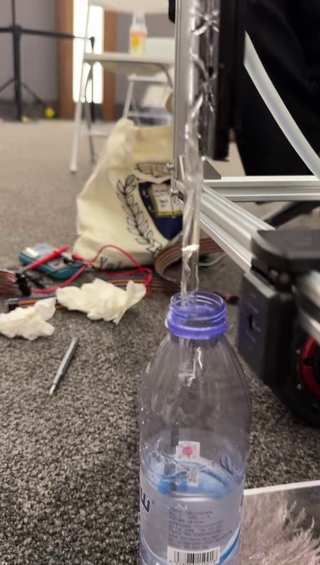
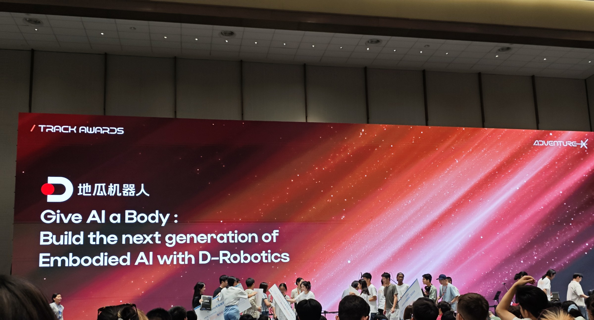
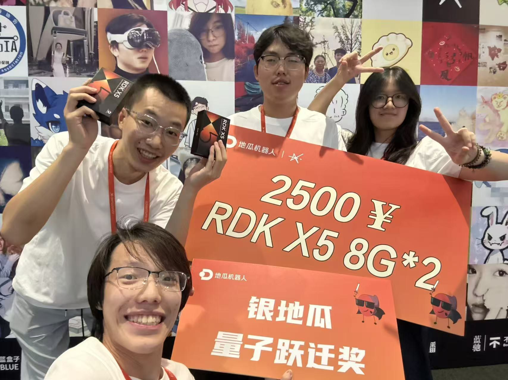

# 演示与媒体 / Demo & Media

本页把现场录像拆成可核验的技术章节，并明确照片能证明什么。媒体来自团队提供的比赛素材，经裁切、转码、旋转/缩放和去元数据；技术演示未纳入原视频末尾的人像交谈段。

## 1. 完整技术片段

**[观看/下载完整技术演示 MP4](../assets/media/demo/rootscope-probe-and-irrigation-demo.mp4?raw=1)**

该片段来自现场原始竖屏录像，保留了约前 33 秒的装置技术内容，并转码为更适合浏览器的格式。裁切不改变动作顺序；原录像后段的人物交谈/人像内容未纳入技术演示。音频如在发布版中被移除，是出于隐私与清晰度考虑。

### 分镜

| 原始时间段（约） | 公开章节 | 看点 | 边界 |
|---|---|---|---|
| 0–6 s | 灌溉头、目标卡、水容器 | 固定式舱体与目标区域 | 不能单独证明完整自动链 |
| 6–24 s | [探针下降](../assets/media/demo/probe-descent.mp4?raw=1) | 齿轮齿条、探针/软管相对运动 | 不提供厘米/根深换算 |
| 24–31.5 s | [注水](../assets/media/demo/water-delivery.mp4?raw=1) | 水泵与出水现象；接水瓶保持原貌 | 一次现场片段，不是流量/长期统计 |
| 31–33.5 s | 目标卡回看 | 演示对象和固定卡合同 | 不是开放世界植物识别 |

## 2. 一次真实演示应如何讲

推荐不夸大的 30 秒解说：

> RootScope 是固定式根区灌溉舱。RDK X5 对固定答辩卡做语义与几何双证据检查；证据冲突、未知或过期就保持 HOLD。通过后只映射到 STM32 的有限下降档位。STM32 负责看门狗、一次性下降、5 秒定时注水和最终关泵。当前机构不自动回升，每轮由操作员手动回顶；步数不是生物根深。

不要使用“自动找根”“精准预测真实根深”“田间长期验证”“全自主无人值守”等说法。

## 3. 关键图片

| 图片 | 说明 | 可支持的结论 |
|---|---|---|
| [`assets/media/hero/rootscope-hero.jpg`](../assets/media/hero/rootscope-hero.jpg) | 最终装置整体 | 固定龙门、探针、水路与承载布局；可见轮式底盘只作承载 |
| [`assets/media/demo/demo-overview.jpg`](../assets/media/demo/demo-overview.jpg) | 注水视频封面 | 原录像 27 秒处的真实出水画面；矿泉水接水瓶未打码 |
| [`assets/media/award/award-stage.jpg`](../assets/media/award/award-stage.jpg) | AdventureX D-Robotics 赛道舞台远景 | 赛事现场与赛道场景；**不能单独证明具体奖项/名次** |
| [`assets/media/award/team-award.jpg`](../assets/media/award/team-award.jpg) | 团队获奖合影 | 银地瓜奖牌、两台 RDK X5 奖品和团队现场记录；奖项表述同时以项目获奖记录与结果说明为准 |

RootScope 在 AdventureX 2026 D-Robotics「Give AI a Body」赛道获得银奖、最终第 2 名。舞台远景只用于说明赛事现场；不把它单独当作名次证明。团队奖项合影中的奖牌/奖品提供视觉佐证，正式技术表述与边界集中在 [`RESULTS_AND_BOUNDARIES.md`](RESULTS_AND_BOUNDARIES.md)。

## 4. 两次完整草丛链

公开回执记录了两次受控现场草丛链：固定卡识别、1024 步单向下降、5 秒注水、关泵并锁存。回执位于 [`evidence/public/`](../evidence/public/)。图片/视频与回执作用不同：

- 视频显示可见物理现象；
- STM32 回执说明命令、状态机和最终输出；
- 视觉回执说明固定输入/同帧证据；
- 人工观察说明真实方向、出水、卡滞与现场安全；
- 任何单项都不应替代其余项。

## 5. 媒体处理与许可

发布处理包括：

- 重新编码图片以去除 EXIF/GPS；
- 裁掉时间/位置水印或其他不必要的定位信息；
- 对敏感屏幕、胸牌、二维码等进行裁切或模糊；
- 演示用矿泉水接水瓶不含项目秘密或私人身份信息，按项目方要求完整保留，不做标签模糊；
- 视频裁切为技术段、浏览器兼容转码并移除不必要元数据；
- 保留原始文件 SHA-256 与公开文件 SHA-256 的内部映射，不公开原设备身份；
- 团队确认可发布的合影才进入公开仓。

媒体版权、处理方法与第三方权利见 [`assets/media/ASSET_PROVENANCE.json`](../assets/media/ASSET_PROVENANCE.json) 和相关许可文件。图片中的赛事标识、硬件品牌和第三方商标归各自权利人所有；使用照片不得暗示赛事方或硬件厂商对二次项目背书。

## English summary

The public technical video is a cropped, transcoded, metadata-stripped excerpt of the original event recording. The personal conversation/portrait segment at the end is excluded. The stage photo establishes event context only; it does not independently prove the award rank. The team award photo shows the silver trophy and two RDK X5 prizes as visual context, while the formal award statement and technical boundaries are documented separately. Step counts are not physical or biological depth.
