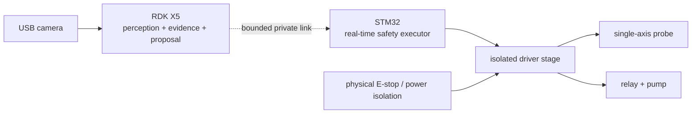

# Hardware Overview

## Public block diagram

## Responsibility split

RDK X5:

- camera acquisition and visual evidence;
- CPU/BPU inference experiments;
- local read-only LLM and RAG;
- deterministic, bounded action proposal;
- evidence receipt generation.

STM32:

- real-time actuator sequencing;
- watchdog and heartbeat supervision;
- timeout and emergency stop;
- final pump-off latch;
- lower-controller identity and state reporting.

## Deliberately omitted

This public document does not provide pin numbers, voltage/current design,
relay polarity, serial frames, unlocking sequence, heartbeat timing, motor step
tables, firmware, calibration, wiring harness details or commissioning
instructions.

Do not infer a safe physical design from this block diagram.

