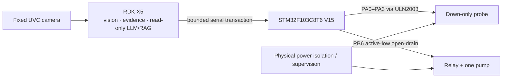

# Hardware Overview / 硬件总览

> This compatibility page points to the maintained final-hardware guides. Earlier public snapshots intentionally omitted implementation details; the current source release includes the final V15 firmware, pin map, build procedure, and staged reproduction gates.

RootScope is a stationary system:

The wheeled chassis visible in photographs is only a carrier/power stand; locomotion is not part of the final chain.

Canonical guides:

- [Final hardware and wiring](HARDWARE_WIRING.md)
- [Mechanical design](MECHANICAL.md)
- [STM32 V15 build and flash](STM32_BUILD.md)
- [RDK X5 staged deployment](RDK_X5_DEPLOYMENT.md)
- [System architecture and authority separation](ARCHITECTURE.md)

Do not connect actuator power before completing the staged checks in those guides. This prototype is not safety-certified.
