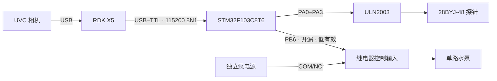

# 硬件与接线 / Hardware & Wiring

本文描述 AdventureX 决赛实物的**最终 V15 最小配置**。`hardware/design/` 中还保留了早期多泵、称重、F407 等设计研究；它们不是最终比赛接线。

> 危险：电机、水泵、继电器与湿区可能造成夹伤、短路、漏水和器件损坏。首次上电必须断开执行器动力，使用限流电源，并由能够判断电气风险的人员在场。本文不是安全认证。

## 1. 最终组成

| 部件 | 最终用途 |
|---|---|
| RDK X5 | UVC 相机、CPU/BPU 视觉、本地 LLM/RAG、证据与事务协调 |
| UVC 相机 | 观察固定答辩卡和演示区域 |
| STM32F103C8T6 | V15 安全状态机与最终执行权限 |
| 3.3 V 兼容 USB–TTL | X5 与 STM32 USART1 通信；比赛中使用 CH340 类适配器 |
| 28BYJ-48 + ULN2003 | 单向驱动齿条探针 |
| 单路低电平触发继电器 | 由 PB6 开漏输出控制 |
| 单路直流水泵、储水容器、软管 | 固定 5 秒演示注水 |
| 独立、匹配额定值的电源 | 分别满足计算、逻辑和执行器功率需求 |

## 2. 信号拓扑

## 3. 最终引脚表

| 功能 | STM32 引脚 | 电气/上电状态 | 连接 |
|---|---|---|---|
| Z 相 A | PA0 | 推挽，默认 Low | ULN2003 IN1 |
| Z 相 B | PA1 | 推挽，默认 Low | ULN2003 IN2 |
| Z 相 C | PA2 | 推挽，默认 Low | ULN2003 IN3 |
| Z 相 D | PA3 | 推挽，默认 Low | ULN2003 IN4 |
| 水泵许可 | PB6 | 开漏、低有效；默认释放 | 继电器控制输入 |
| 串口 TX | PA9 / USART1_TX | 3.3 V TTL | USB–TTL RX |
| 串口 RX | PA10 / USART1_RX | 3.3 V TTL | USB–TTL TX |
| 调试 | PA13 / SWDIO | 3.3 V | ST-Link/CMSIS-DAP SWDIO |
| 调试 | PA14 / SWCLK | 3.3 V | ST-Link/CMSIS-DAP SWCLK |

PB7 未使用；PA4–PA7 是退役输出并保持关闭。最终固件常量以 [`app_config.h`](../firmware/stm32f103-v15/Core/Inc/app_config.h) 和 CubeMX [`.ioc`](../firmware/stm32f103-v15/STM32F103_Irrigation.ioc) 为准。

### USB–TTL

- TX/RX 必须交叉连接并共地。
- 只使用 3.3 V TTL 逻辑；RS-232 电平不能直连。
- STM32 已独立供电时，不连接 USB–TTL 的 VCC/5V，避免反向供电。
- 串口配置为 115200 bit/s、8 data bits、no parity、1 stop bit。
- Linux 端应使用稳定的 udev 别名；不要依赖可能变化的 `ttyUSB` 枚举序号。
- 公开配置必须使用占位符，设备 VID/PID、物理端口和唯一标识应在本机录入，不提交到 Git。

### 步进电机

- 保持 INA/INB/INC/IND 与 PA0/PA1/PA2/PA3 顺序一致。
- ULN2003 承担线圈电流；STM32 GPIO 不得直驱电机。
- 最终档位为 1024/1536/2048 相对步数，`12 ms` 为冻结步进间隔。
- 机构无顶部/底部限位，软件步数不能替代机械限位。
- 最终演示只允许向下档位；不要增加自动反向动作来“回顶”。

### 继电器与水泵

- PB6 使用开漏、低电平吸合。`SET` 是释放/关泵，`RESET` 是吸合/开泵。
- 继电器控制侧与触点功率侧必须按实际模块规格接线；不要根据颜色或非标准丝印猜测。
- 泵动力经过继电器 COM/NO，默认断开；NC 不用于本项目。
- 水泵使用匹配额定值的独立电源，不能由 STM32 3.3 V 或 RDK X5 GPIO 供电。
- 电机/泵的浪涌、续流、线径、保险与端子额定值必须依据实物测量选择；仓库不虚构额定参数。
- 湿区在电子设备下方并设置接水盘、滴水环和应力释放。

## 4. 电源域

建议至少分成三域：

1. **计算域**：RDK X5 与相机；
2. **逻辑域**：STM32、USB–TTL、ULN2003/继电器控制侧；
3. **执行器域**：步进电机和水泵功率。

电源负极/逻辑地是否共地应按具体隔离方案和模块说明确认。无隔离的 TTL 通信必须有信号参考地；功率回流不得经过 X5 或 STM32 的细线/接口。推荐增加能够物理切断执行器域的急停或总断开装置；最终黑客松原型的固件 STOP 和看门狗不等于硬件安全回路。

## 5. 分级上电门

| 阶段 | 执行器动力 | 只允许的检查 | 通过条件 |
|---|---|---|---|
| A 通断检查 | 全断 | 极性、短路、接地、端子、湿区隔离 | 无短路/错接 |
| B 逻辑上电 | 断开 | STM32 版本、PB6 释放、PA0–PA3 全低 | 输出关闭、身份一致 |
| C 串口只读 | 断开 | `VERSION`、`STATUS`、`IOSTATUS` | 锁存、无任务、输出关闭 |
| D 假负载 | 泵断开 | 指示灯/万用表验证 STOP、复位、掉线 | 所有故障都回到关闭 |
| E 单执行器 | 单路限流 | 极短电机/泵测试、方向、温升 | 人工确认且最终关闭 |
| F 湿式 | 泵接通 | 漏水、软管、继电器、5 秒硬超时 | 水路安全且回执一致 |

每一级失败都停止，不能通过修改超时、跳过身份或自动重试来迁就硬件。

## 6. 最低安全清单

- [ ] 执行器电源可以物理断开；
- [ ] PB6 上电/复位/烧录期间保持继电器释放；
- [ ] PA0–PA3 在空闲与故障时全低；
- [ ] STM32 版本、build、capabilities 与软件期望一致；
- [ ] 心跳丢失、UART 故障和 STOP 都能关泵并释放线圈；
- [ ] 机构行程内无手指、线缆、软管和硬限位碰撞；
- [ ] 操作员已经确认探针人工回顶；
- [ ] 接水盘、吸水材料和断电手段在手边；
- [ ] 现场有人持续监护。

## English summary

The final system uses an RDK X5, a 3.3 V USB–TTL link to USART1, an STM32F103C8T6, PA0–PA3 through a ULN2003 to a 28BYJ-48 probe drive, and PB6 as an active-low open-drain relay control for one pump. Never power the motor or pump from MCU/X5 GPIO. Bring the system up in stages with actuator power disconnected first. The prototype has no automatic retraction or limit switch and is not safety-certified.
