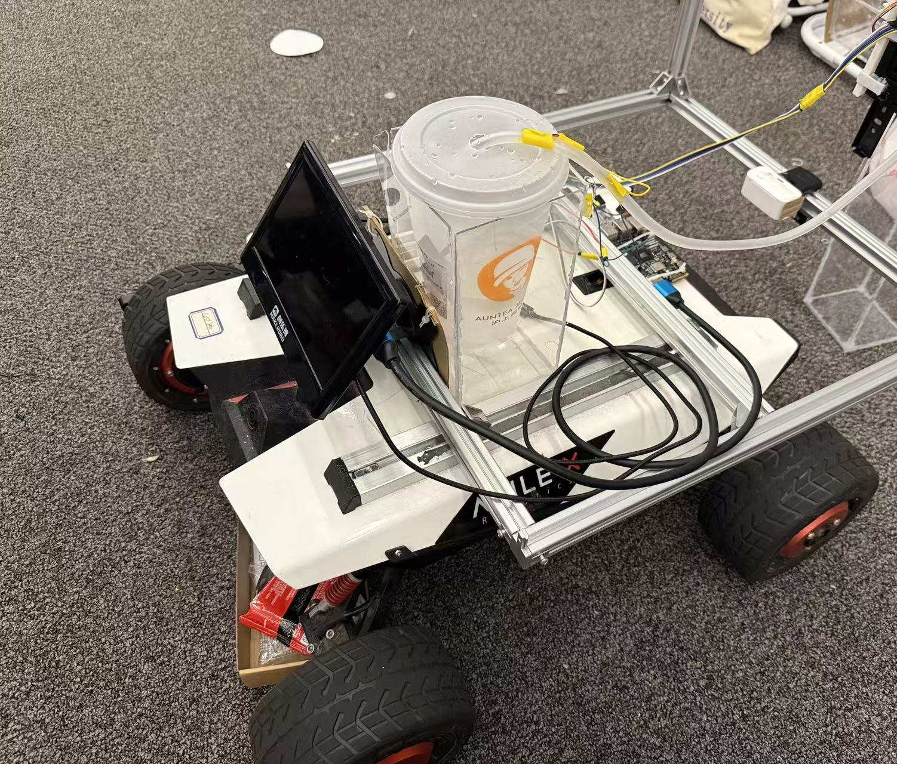

# 机械结构 / Mechanical Design

RootScope 的最终形态是**固定式根区灌溉舱**：相机观察固定区域，齿条探针沿竖直方向单向下降，软管在目标附近注水。它不是移动灌溉小车。



## 1. 结构分解

| 模块 | 作用 | 关键边界 |
|---|---|---|
| 承载底座 | 支撑 X5、控制板、储水容器和龙门 | 照片中的轮式底盘只作承载架，不接入运动链 |
| 龙门/立柱 | 固定相机、步进电机和探针导向 | 必须抵抗探针卡滞时的扭转 |
| 齿轮齿条/滑轨 | 把 28BYJ-48 转动转换为探针下降 | 无绝对位置传感；步数不是长度 |
| 探针 | 到达答辩卡/目标区域附近 | 不用于测量根深或土壤水分 |
| 水路 | 储水容器、单泵、软管与出水端 | 与电子区分离，留滴水环和应力释放 |
| 相机架 | 固定视角和工作距离 | 不能让软管/探针遮挡答辩卡 ROI |

设计参考图位于：

- [`hardware/design/mechanical/rootscope_exploded.svg`](../hardware/design/mechanical/rootscope_exploded.svg)
- [`hardware/design/mechanical/rootscope_front_side.svg`](../hardware/design/mechanical/rootscope_front_side.svg)
- [`hardware/design/mechanical/rootscope_cutlist_bom.csv`](../hardware/design/mechanical/rootscope_cutlist_bom.csv)

这些图纸记录了设计演进，采购或加工前必须以最终实物重新测量。旧文档中的多层出水、移动底盘或多泵方案不等于决赛装置。

## 2. 为什么是固定式

固定式结构让比赛原型把有限时间集中在三件事上：保持相机光学条件可控、给探针/水路建立可审计动作边界、让下位机故障时保持关闭。移动底盘会额外引入定位、碰撞、轮速、导航和电源瞬态，最终系统没有将这些能力纳入验证。

一些照片中仍能看到 Scout Mini 轮式底盘。它是现成的稳固承载和供电底座，轮子与底盘接口没有进入决赛控制程序；不能据此把 RootScope 描述为移动机器人。

## 3. 探针行程合同

- 档位 1/2/3 分别是 1024/1536/2048 相对步数。
- 这些数值没有标定为毫米、厘米或生物根深。
- 只有“向下”被固件允许；一次人工回顶确认只消费一次下降机会。
- 机构没有自动回升和顶部传感器。每轮后由操作员切断/确认安全，再手动回顶。
- 运动前检查软管余量、线缆弯曲半径、齿条啮合和行程末端空间。

如要做二次开发，应先增加独立上下限位、可靠零位、机械防脱和过载/卡滞检测，再重新定义带物理单位的标定。不要仅用当前步数推算位移。

## 4. 相机与光学布置

1. 相机支架应与龙门刚性连接，避免泵和步进电机振动改变视角。
2. 固定焦距/曝光/白平衡后再采集模板与验收图。
3. 答辩卡平面尽量与相机光轴正交，减少反光、弯曲和透视畸变。
4. ROI 中避免探针、软管、手和屏幕反射。
5. 任何支架、灯光或相机位置变化都使原光学资格失效，应重新采集而不是降低阈值。

## 5. 水路布置

- 水容器放在低于或远离计算板的位置，防止倾倒直接淋湿电子设备。
- 软管在运动段留足余量，但不能形成可能卷入齿轮的松环。
- 出水头固定，避免喷流反作用改变位置。
- 继电器关断后仍可能有软管残水；验收要观察滴漏和虹吸，而不只是 MCU 状态。
- 湿式测试下方设置接水盘；测试结束排空并擦干。

## 6. 装配与验收

```text
框架直角/紧固 → 空载手动滑动 → 电机断电手动回顶
→ 相机视场锁定 → 软管静态布置 → 低速无水运动
→ 三档分别受控验证 → 假负载继电器 → 5 秒湿式测试
```

对每一档记录：起始人工回顶状态、相对步数、运动方向、是否卡滞、完成回执、最终线圈释放、软管位置。任何异常都停止，不自动重复。

## English summary

RootScope is a stationary gantry with a camera, rack-driven downward probe, and one water line. The visible wheeled chassis is only a carrier/power stand. The competition mechanism has no automatic retraction, absolute encoder, or limit switch; an operator manually returns it to the top between runs. Step presets are not physical depth units.
